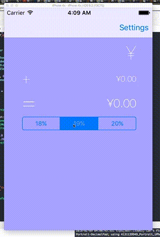

# tipsCalculatorSwift
Tip
==================

Tip Calculator app
Time spent: 10 hours

Completed user stories:

* [x] Required: Basic tip calculator functionatliy
* [x] Required: Settings page/ choose currency
* [x] Optional: Remember the bill amount across app restarts
* [x] Optional: Change percentage of tip
* [x] Optional: Change app's background color, font

**Walkthrough of required and optional user stories:**

